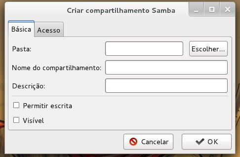

# MS - Manager samba

## Descrição:

A aplicação será um ambiente de gerenciamento de um servidor de compartilhamento de arquivos através do sistema SAMBA, utilizada nas distribuições Linux como um servidor smb para sistemas Windows. 

## Objetivo:

Prover um ambiente de serviço Web com uma interface gráfica de gerenciamento do serviço Samba de forma agrádevel, flexível e dinâmica para o compartilhamento de arquivos, definindo grupos, usuários e suas permissões, e as cotas de disco para cada pasta.

## Inspiração:

O própio samba é uma ótima ferramenta para compartilhamento de arquivos, 
mas toda a sua configuração é feita de forma manual na edição de arquivos, 
sendo assim percebe-se a necessidade de um sistema mais dinâmico e versátil
e intuitivo. Algumas plataformas como webmin são um exemplo de aplicação com interface gráfica para gerenciamento do sistema.

### 

## Protótipos:
